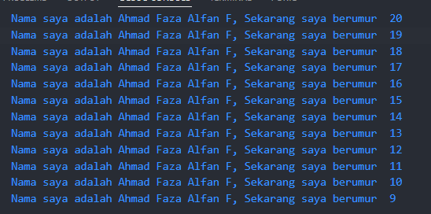

# Jobsheet 1_Pengantar Bahasa Pemrograman Dart - Bagian 1


**Nama : Ahmad Faza Alfan Fashlah
Kelas : 2F - 03
NIM : 2241720186**

## TUGAS PRAKTIKUM
### Jawaban Soal Nomor 1
```java
void main() {
  for (int i = 20; i >= 9; i--) {
    print('Nama saya adalah Ahmad Faza Alfan F, Sekarang saya berumur  $i');
  }
}
```
### Output Soal Nomor 1


### Jawaban Soal Nomor 2
Dart merupakan bahasa inti di balik framework Flutter. Pemahaman tentang Dart menjadi fondasi penting dalam pengembangan aplikasi dengan Flutter. Pengembang perlu memahami latar belakang Dart, peran komunitas dalam perkembangannya, keunggulan bahasa ini, dan alasan Dart dipilih, termasuk kemampuannya untuk dikompilasi ke kode asli, performa tinggi, serta kemudahan dalam membangun UI yang responsif.

### Jawaban Soal Nomor 3
Secara keseluruhan codelab ini membahas mengenai  
1. Geeting started with Dart 
➢ Dart menawarkan fitur modern seperti alat produktif, garbage collection, dan tipe data opsional, serta dapat dikompilasi ke berbagai platform. Dengan keamanan tipe statis dan kemampuan untuk berjalan di web maupun kode native, pemahaman Dart sangat penting untuk mengembangkan aplikasi Flutter secara efisien. 

2. The evolution of Dart 
➢ Dart, diluncurkan pada 2011, awalnya untuk web dan kini fokus pada pengembangan mobile dengan Flutter. Dirancang untuk menggantikan JavaScript, Dart menawarkan performa tinggi dan fleksibilitas melalui fitur OOP dan tipe opsional. Kemampuannya yang terus berkembang menjadikannya pilihan tepat untuk Flutter. 

3. How Dart works 
➢ Kode Dart dapat dijalankan melalui Dart VM atau dikompilasi menjadi JavaScript untuk eksekusi lintas platform. Kompilasi JIT mendukung pengembangan cepat dengan fitur seperti hot reload, sementara AOT memberikan performa tinggi untuk aplikasi produksi dengan kompiler yang lebih optimal. 

4. Introducing the structure of the Dart language 
➢ Dart adalah bahasa pemrograman berorientasi objek yang mudah dipelajari, terutama bagi mereka yang sudah familiar dengan bahasa pemrograman seperti C atau JavaScript 

5. Hands-on with Dart 
➢ DartPad adalah alat yang ideal untuk mulai belajar Dart dengan menulis dan menjalankan kode secara langsung. Program Dart dimulai dari fungsi `main`, yang tidak mengembalikan nilai dan berisi logika utama.