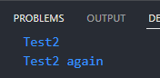
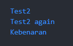
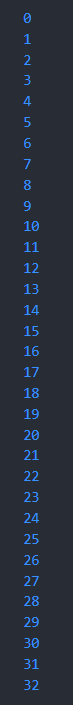
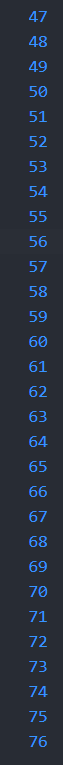
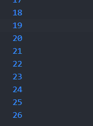
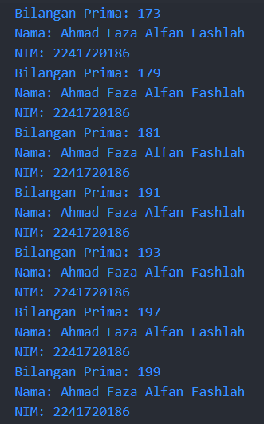

# Jobsheet 3_Pengantar Bahasa Pemrograman Dart - Bagian 2


**Nama : Ahmad Faza Alfan Fashlah
Kelas : 3C - 02
NIM : 2241720186**

## PRAKTIKUM 1
### Langkah 1
```java
void main(){
  // Langkah 1
  String test = "test2";
  if (test == "test1"){
    print("Test1");
  } else if (test == "test2"){
    print("Test2");
  } else {
    print("Something else");
  }

  if (test == "test2") print("Test2 again");
}
```
### Langkah2
<br>
* Kode tetap bisa dijalankan, namun penulisan "Else If" dan "Else" salah kapitalisasi, seharusnya "else if" dan "else". Sebaiknya syntax harus ditulis dengan benar agar menghindari error.

### Langkah 3
```java
Tambahkan kode program berikut, lalu coba eksekusi (Run) kode Anda.

void main(){
  // Langkah 3
  String test = "true";
  if (test) {
   print("Kebenaran");
}
}

Apa yang terjadi ? Jika terjadi error, silakan perbaiki namun tetap menggunakan if/else.
```
* Jika kode tersebut dijalankan, akan terjadi error. Penyebabnya adalah karena variabel test bertipe String dan tidak bisa langsung digunakan sebagai kondisi boolean dalam if.

Berikut adalah syntax yang sudah di modifikasi 
``` java
void main(){
String test2 = "true";
  if (test2 == "true") {
   print("Kebenaran");
  } else {
   print("Hoax Hoax Hoax");
  }
}
```
<br>
* Modifikasi dilakukan dengan mengubah if (test) menjadi if (test == "true"), sehingga sekarang membandingkan string test dengan "true". Ini memperbaiki error karena kondisi if sekarang menghasilkan nilai boolean, bukan hanya memeriksa apakah variabel test ada


## PRAKTIKUM 2
### Langkah 1
``` java
void main(){
  while (counter < 33) {
    print(counter);
    counter++;
  }
}
```
### Langkah 2
* Terjadi error karena variabel counter belum diinisialisasi. Dalam Dart, variabel harus diinisialisasi sebelum digunakan. Untuk memperbaikinya, inisialisasikan counter terlebih dahulu:

Berikut modifikasinya :
``` java
void main(){
  int counter = 0;
  while (counter < 33) {
    print(counter);
    counter++;
  }
}
```
<br>

### Langkah 3
``` java
Tambahkan kode program berikut, lalu coba eksekusi (Run) kode Anda.

do {
  print(counter);
  counter++;
} while (counter < 77);
```
<br>
* Kode program dapat dijalankan karena variable counter sudah diinisialisasi, akan terjadi error bila variable counter belum diinisialisasi.

## PRAKTIKUM 3
### Langkah 1
``` java
void main(){
  for (Index = 10; index < 27; index) {
    print(Index);
  }
}
```

### Langkah 2
* Error terjadi karena tidak adanya tipe data untuk variable `Index` dan seharusnya penulisannya dirubah menjadi `index` . Tambahkan juga `index++` untuk melakukan increment pada perulangan.

berikut setelah di modifikasi :
``` java
void main(){
  for (int index = 10; index < 27; index++) {
    print(index);
  }
}
```
<br>

### Langkah 3
``` java
Tambahkan kode program berikut di dalam for-loop, lalu coba eksekusi (Run) kode Anda.

void main(){
  If (Index == 21) break;
  Else If (index > 1 || index < 7) continue;
  print(index);
}
```
* Output tidak muncul karena perintah `break` menghentikan perulangan saat `index` mencapai 21. Selain itu, `print(index)` tidak dijalankan karena `continue` akan melewati iterasi jika `index` antara 2 hingga 6. Akibatnya, tidak ada nilai yang dicetak sebelum perulangan berhenti.

Berikut modifikasinya : 
``` java
void main() {
  for (int index = 0; index < 27; index++) {
    if (index == 21) {
      print(index);
      break;
    } else if (index > 1 || index < 7) {
      print(index);
      continue;
    }
    print(index);
  }
}
```

## TUGAS PRAKTIKUM
1. Silakan selesaikan Praktikum 1 sampai 3, lalu dokumentasikan berupa screenshot hasil pekerjaan beserta penjelasannya!
   * Jawaban terdapat pada file Laporan dengan format md

2. Buatlah sebuah program yang dapat menampilkan bilangan prima dari angka 0 sampai 201 menggunakan Dart. Ketika bilangan prima ditemukan, maka tampilkan nama lengkap dan NIM Anda.
``` java
void main() {
  for (int num = 0; num <= 201; num++) {
    if (isPrime(num)) {
      print('Bilangan Prima: $num');
      print('Nama: Ahmad Faza Alfan Fashlah');
      print('NIM: 2241720186');
    }
  }
}

bool isPrime(int number) {
  if (number <= 1) return false;
  if (number <= 3) return true;
  if (number % 2 == 0 || number % 3 == 0) return false;
  
  for (int i = 5; i * i <= number; i += 6) {
    if (number % i == 0 || number % (i + 2) == 0) return false;
  }
  return true;
}
```
<br>

3. Kumpulkan berupa link commit repo GitHub pada tautan yang telah disediakan di grup Telegram!